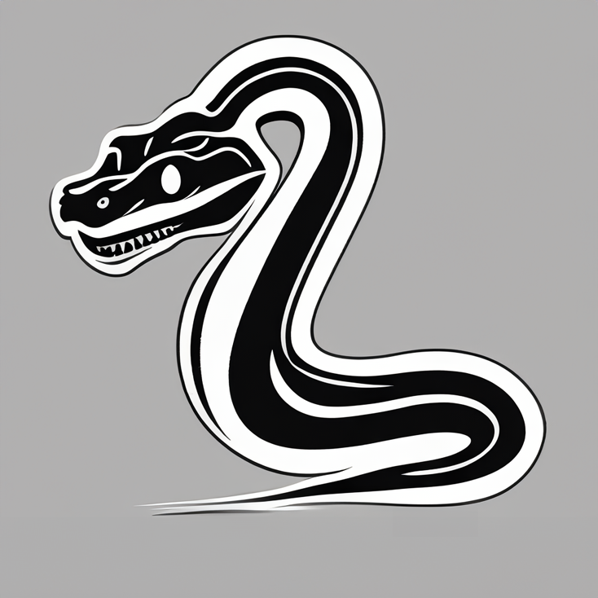
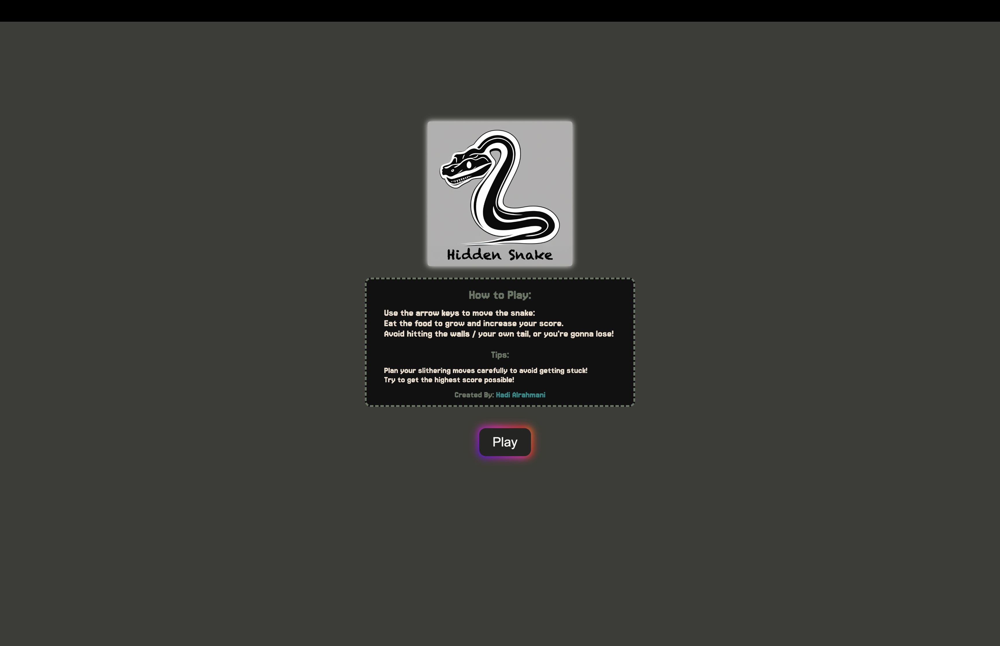
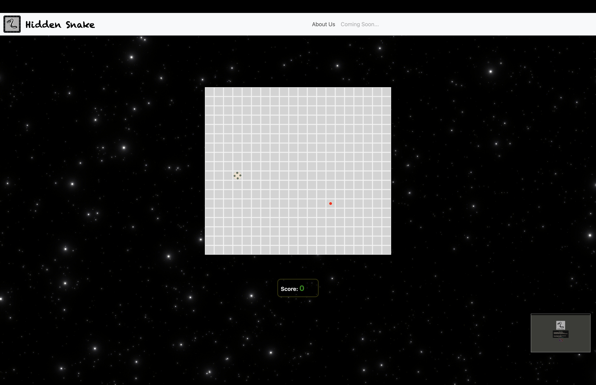
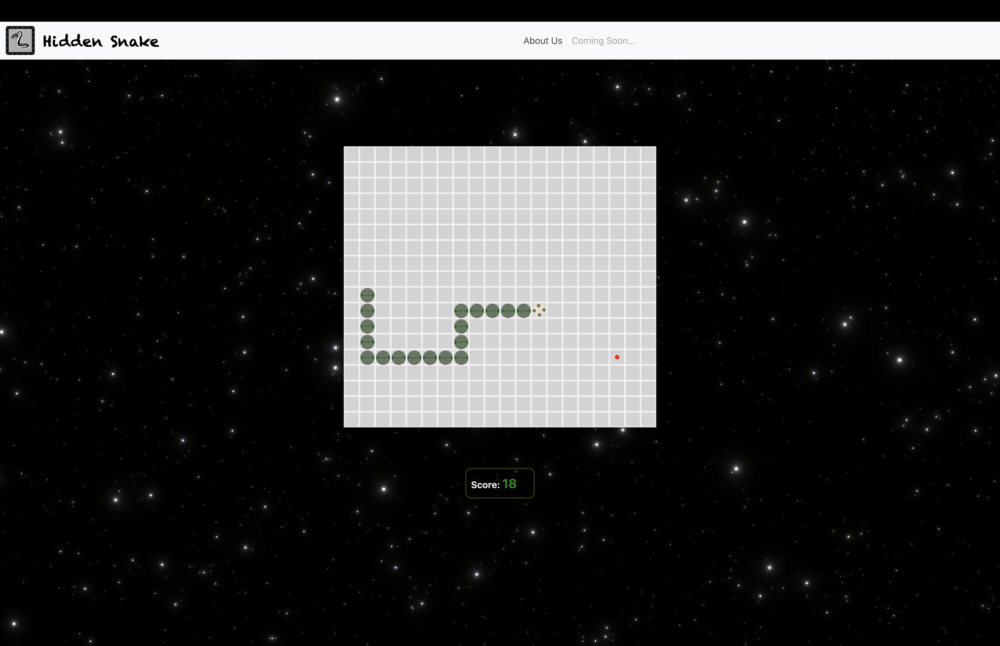
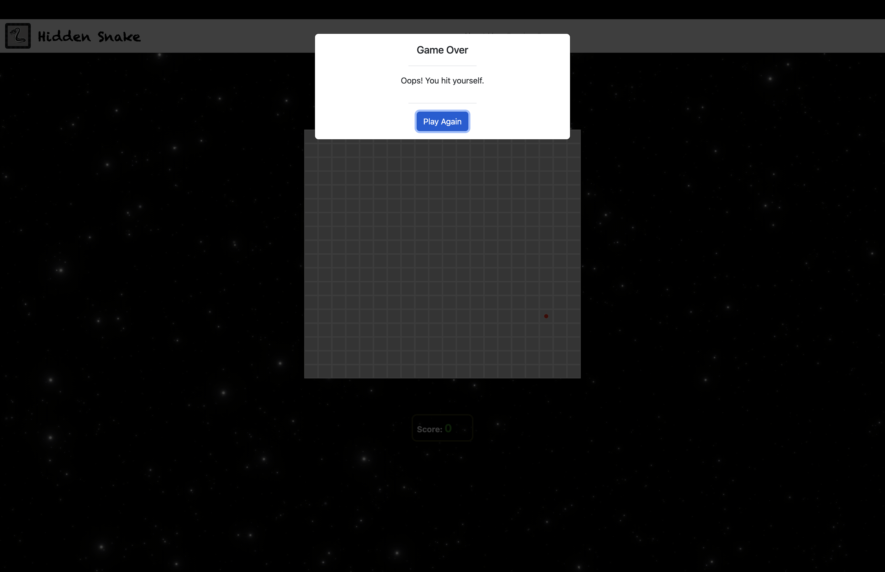
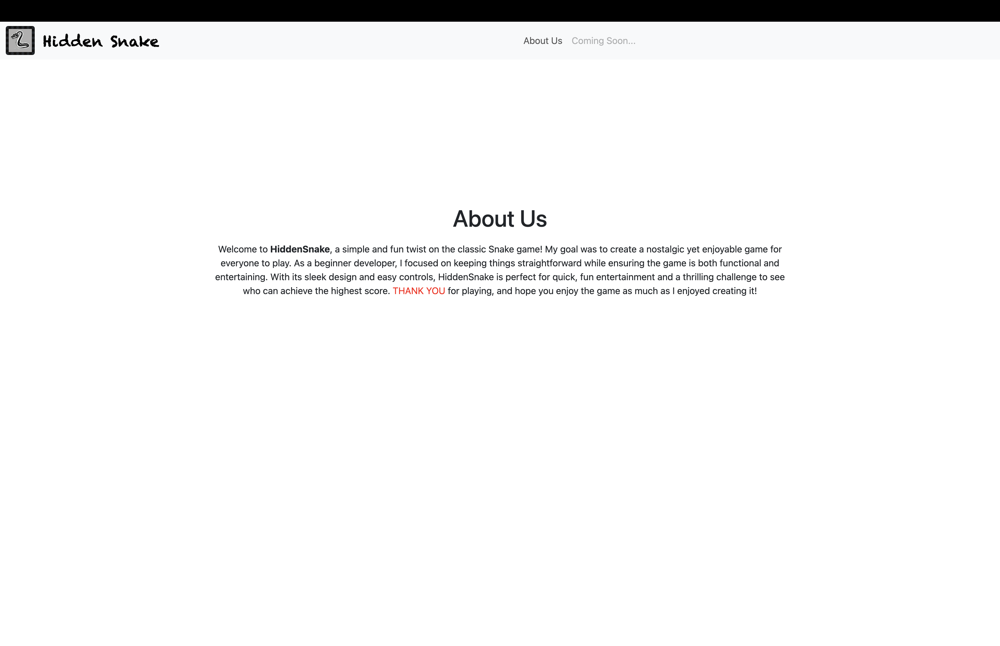

# HiddenSnake

* By: Hadi Alrahmani

#### Game Demonstration:

> **HiddenSnake** is a classic game where the player controls a snake that grows longer each time it eats food, while avoiding collisions with the walls and itself. The goal is to collect as much food as possible without dying.

[Deployment Link](https://hadialrahmani.github.io/HiddenSnake/index.html)

[Repo](https://github.com/hadiAlrahmani/HiddenSnake)

## Technologies
-	Created images via adobe photoshope

-	Editing audio & sound effects using adobe premier pro

-	Trello for project planning

+ HTML

+ CSS

+ JavaScript

### Next Steps (Future enhancments):

-	Implement a pause button to stop the game.

-	Implementing a mute & unmute button for the background music.

-	Add leaderboard to store highscore values.

-	And much more!

